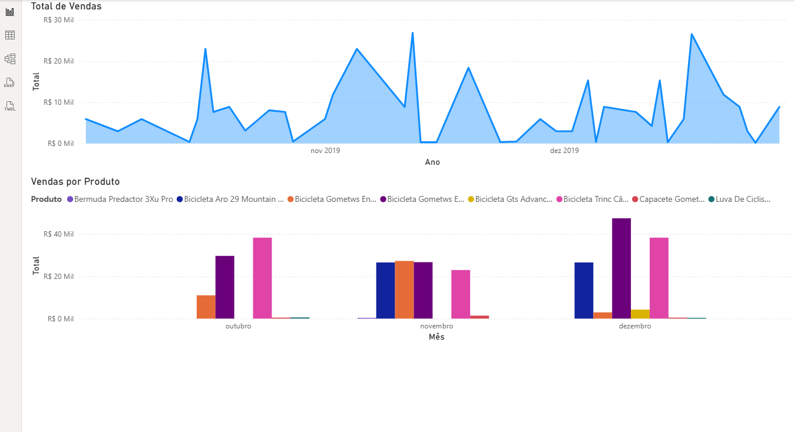
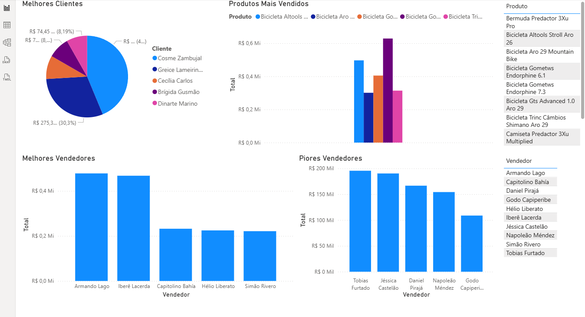

# 📊 Dashboard de Vendas – Power BI

## 📌 Sobre o Projeto
Este projeto foi desenvolvido com o objetivo de analisar o desempenho de vendas por meio de um **dashboard interativo no Power BI**, facilitando a visualização dos principais indicadores e apoiando a **tomada de decisão baseada em dados**.

A proposta do dashboard é simular um cenário real de negócio, permitindo compreender o comportamento das vendas, identificar oportunidades de melhoria e acompanhar resultados de forma clara e objetiva.

---

## 🎯 Objetivos da Análise
- Acompanhar o desempenho das vendas ao longo do tempo  
- Identificar produtos e categorias com maior impacto no faturamento  
- Analisar o comportamento das vendas por região  
- Apoiar decisões estratégicas por meio de indicadores  

---

## 📈 Indicadores Acompanhados
- Faturamento total  
- Quantidade de vendas  
- Ticket médio  
- Evolução das vendas por período  
- Desempenho por produto e categoria  
- Análise regional das vendas  

---

## 🔎 Principais Análises
Durante o desenvolvimento do dashboard, foi possível realizar análises como:
- Identificação dos produtos com maior participação no faturamento  
- Avaliação de tendências de crescimento ou queda nas vendas  
- Comparação de desempenho entre diferentes regiões  
- Observação de padrões de sazonalidade no consumo  

---

## 🛠️ Ferramentas Utilizadas
- Power BI  
- Modelagem de dados  
- DAX (nível básico)  
- Técnicas de visualização de dados  

---

## 🖼️ Visão do Dashboard

---

## 📂 Arquivos do Projeto
- `dashboard-vendas.pbix` — Relatório desenvolvido no Power BI  

---

## 💡 Considerações
Este projeto faz parte do meu **portfólio de Data Analytics** e representa meu processo de aprendizado na análise, organização e visualização de dados, com foco em gerar informações claras e úteis para apoiar a tomada de decisão.
