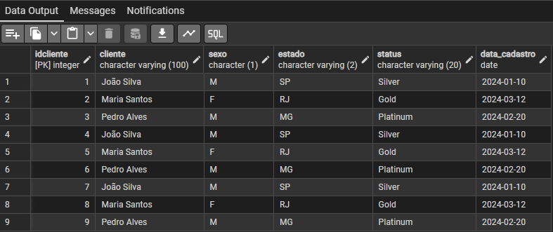
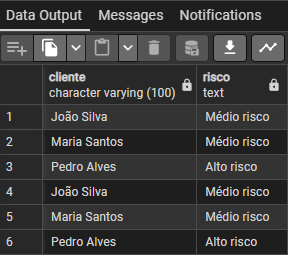

# Projeto: Análise de Crédito e Inadimplência

## 💡 Sobre o projeto
Este projeto foi criado para treinar habilidades importantes para quem atua (ou quer atuar) na área de **Analytics/Crédito e Cobrança**.  
Aqui eu construo um pequeno banco de dados fictício e utilizo **SQL** para analisar clientes, vendas, vendedores e identificar possíveis riscos de inadimplência.

É um projeto simples, mas que demonstra claramente meu domínio em consultas SQL, joins, agregações e criação de indicadores.

---

## 🛠 Ferramentas utilizadas
- **PostgreSQL** – Banco de dados onde tudo foi executado  
- **pgAdmin 4** – Interface para rodar as queries  
- **SQL** – Linguagem principal do projeto  

---

## 📚 O que foi feito
- Criação das tabelas: `clientes`, `vendedores` e `vendas`
- Inserção de dados simulando um cenário real de vendas
- Consultas básicas e intermediárias:
  - filtros (`WHERE`, `IN`, `BETWEEN`, `LIKE`)
  - ordenações (`ORDER BY`)
  - limites (`LIMIT`)
- Contagens e agregações:
  - total de vendas
  - soma dos valores
  - quantidade de vendas por vendedor
- JOINs para cruzar informações entre clientes, vendas e vendedores
- Criação de um **indicador simples de risco**, classificando clientes em:
  - alto risco  
  - médio risco  
  - baixo risco  

Esse indicador é útil em áreas de crédito e cobrança para apoiar decisões de priorização.

### 📊 Resultado das Consultas 

---

## ▶ Como executar o projeto
1. Abra o **pgAdmin 4**  
2. Crie um banco de dados (ex.: `analytics_credito`)  
3. Cole e execute o conteúdo do arquivo `projeto_analytics_credito.sql`  
4. Rode as consultas e observe os resultados  

---

